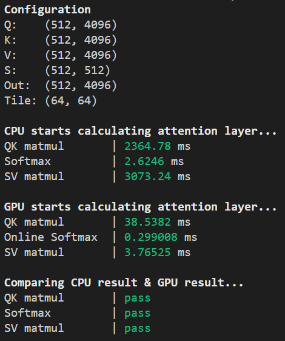

## Attention Layer in LLM

### Main Target
Attempt to learn detail architecture and algorithm in LLM (large language model). </br>
Starts from naive build-up to advanced optimizing technique (ex: flash attention, online-softmax, ...). </br>
By comparing metrics changes between different algorithm to enhance understanding of LLM and Cuda implementation skills. </br>

### Implemented Content
* Currently, implementation only handle forward-propagartion state
1. Attention Layer
   - QK matmul
     - `Q(seq_len, d_model)` @ `K_transpose(d_model, seq_len)`) = `S(seq_len, seq_len)`
     - using block-level shared memory
   - Softmax
     - `Score_max(seq_len)` = softmax_row_max(`S(seq_len, seq_len)`)
     - `Weighted_score(seq_len, seq_len)`= softmax_row_norm(`Score_max(seq_len)`)

### Cuda Algorithm
- The following vitualize Cuda algorithm to get more understanding of how to leverage CUDA parallelism better
#### QK matmul tiling


### Metrics Discussion


### Compile & Run
```
1. nvcc attentionLayerKernel.cu -o attentionLayer
2. attentionLayer.exe
```
